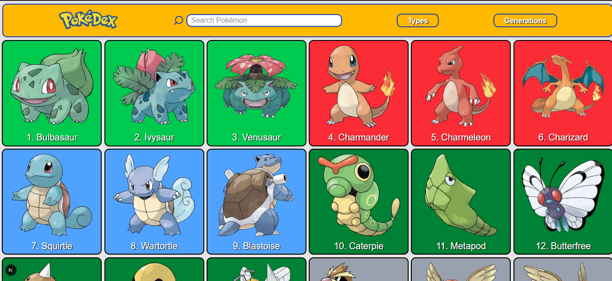
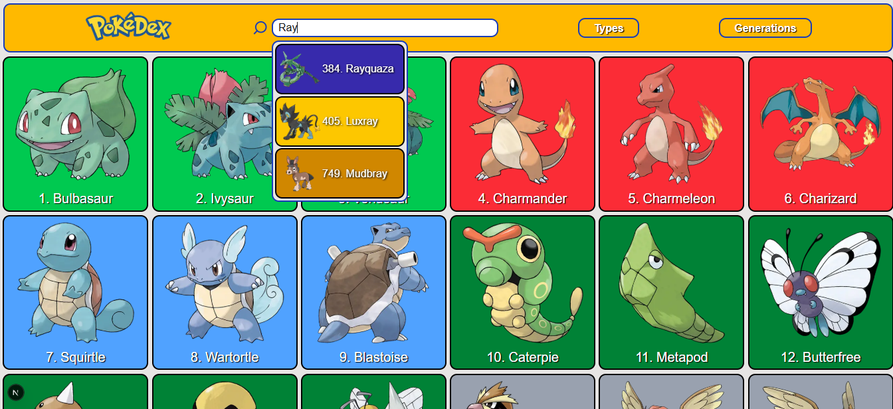
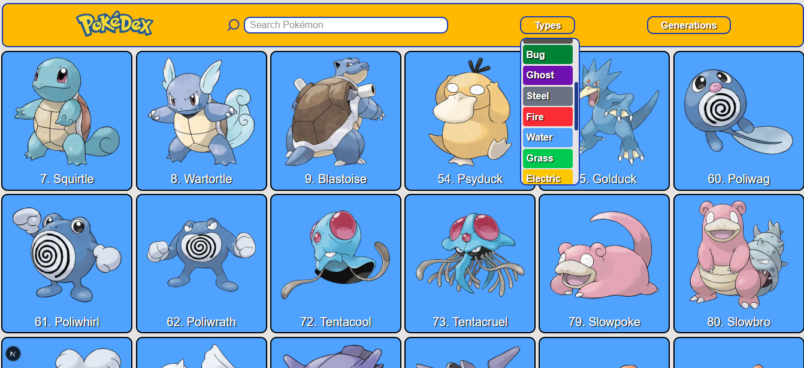
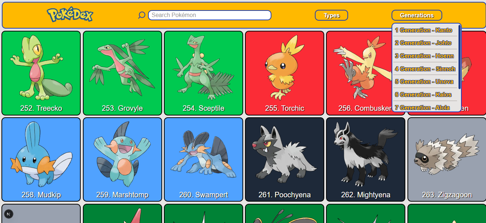

English | [Español](README.es.md)

# Pokedex App

[](https://nextjs.org/)
[](https://reactjs.org/)
[](https://www.typescriptlang.org/)
[](https://tailwindcss.com/)
[](https://github.com/pmndrs/zustand)

Pokedex web app built with **Next.js**, **TypeScript**, **Zustand** and **TailwindCSS**.
It allows users to explore Pokemon, view their types, generations and evolution chains using the official **PokéAPI**.

## Features

- Browse all Pokemon with detailed data.
- View evolution chains and species info.
- Filter pokemon by type or generation.
- Optimized data fetching with custom React hooks.
- Global state management using Zustand.
- Infinite scroll: Pokemon are loaded progressively as user scroll.

## Tech Stack

- **Next.js 15**
- **React 19**
- **TailwindCSS 4**
- **Zustand**
- **TypeScript**
- **Jest + Testing Library**

## Installation

Clone the repository:

```bash
git clone https://github.com/Antonio-Borrero/pokedex-app.git
cd pokedex-app

npm install
# or
yarn install
# or
pnpm install
# or
bun install
```

## Getting Started

First, run the development server:

```bash
npm run dev
# or
yarn dev
# or
pnpm dev
# or
bun dev
```

## Running Tests

Run the test suite with:

```bash
npm run test
# or
yarn test
# or
pnpm test
# or
bun test
```

Open [http://localhost:3000](http://localhost:3000) with your browser to see the result.

## Usage

- Browse the Pokemon list by scrolling down the page.
- Click on a Pokemon to view detailed info, including types, initial stats, and evolution chain.
- Use the filters in the navbar to select Pokemon by type or generation.
- Use the search bar to quickly find a Pokemon by name.

## Screenshots







## Data Source

This app uses [PokéAPI](https://pokeapi.co/) to fetch Pokemon data including types, generations, evolution chains and sprites.
