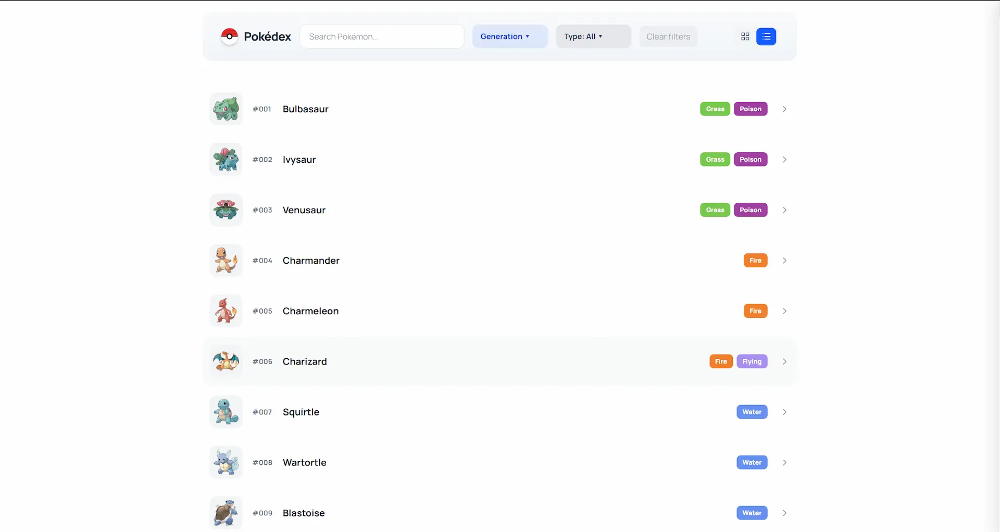
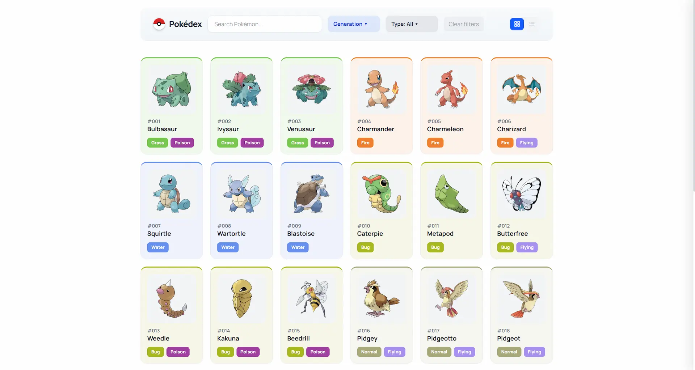
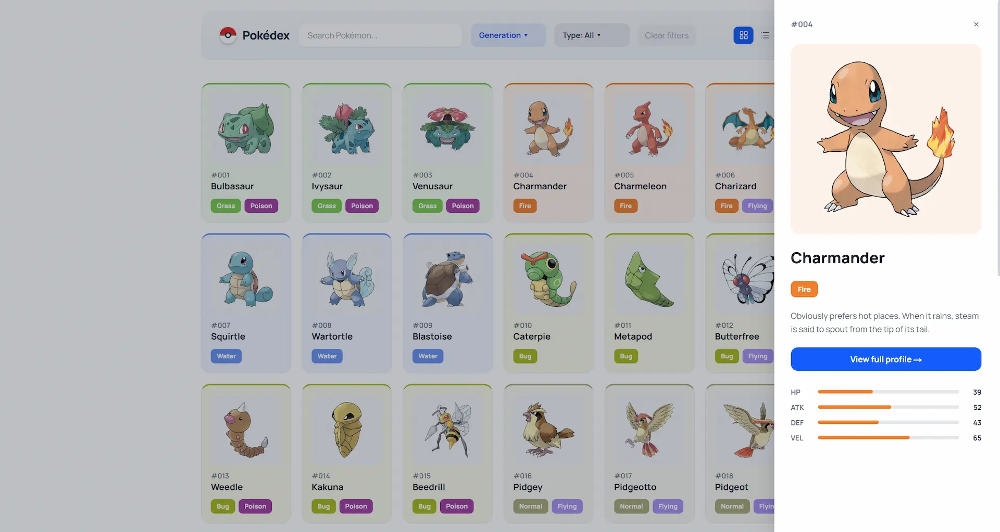
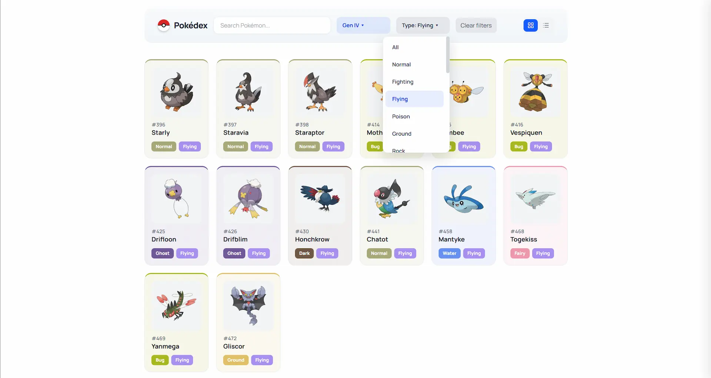
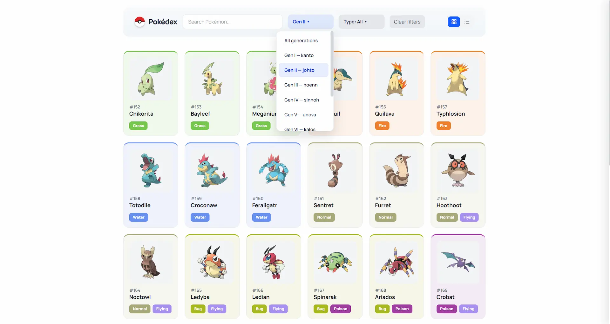
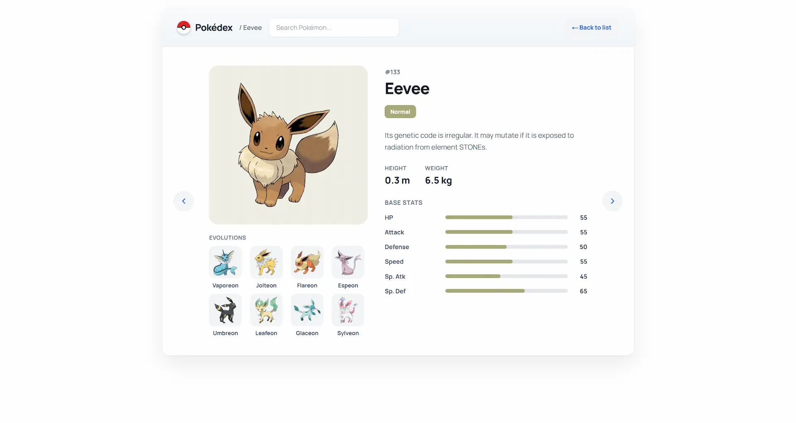
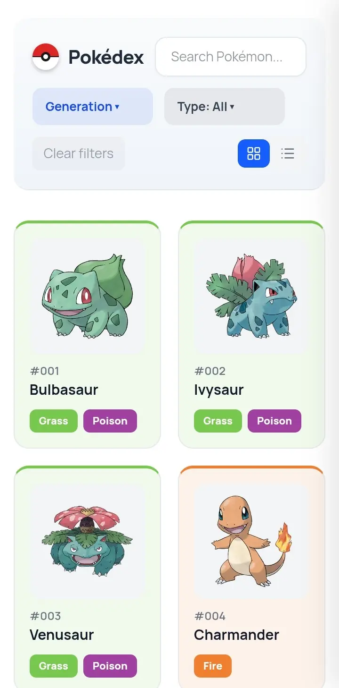

English | [Español](README.es.md)

# Pokedex App

[](https://nextjs.org/)
[](https://www.typescriptlang.org/)
[](https://tailwindcss.com/)
[](https://github.com/pmndrs/zustand)



<br>

This is my first independent personal project, developed outside of any bootcamp or formal course. My goal wasn't to build the "perfect app," but to experiment with new tools and understand their workflows.

- **First steps with Next.js & Tailwind:** I used this project to jump into the Next.js ecosystem and Tailwind CSS. It was a "learning by doing" experience to understand file-based routing and utility-first styling.
- **State Management (Zustand vs Redux):** I explored Zustand as a lightweight alternative to Redux. While I'm still evaluating performance differences, I found its developer experience much more intuitive for this scale of project.
- **Performance Trade-offs:** To ensure a seamless global search, I chose to fetch the full Pokémon list on the initial load. To balance this, I implemented an Intersection Observer for the list rendering, ensuring images only load as they enter the viewport.
- **Introduction to Testing:** This was my first contact with Jest. Although the testing suite is basic and I'm still mastering the "testing mindset," it laid the foundation for my future focus on code reliability.

I am aware there is much room for improvement, and I plan to update this project as I continue to grow as a developer.

<br>

## Features

- Browse all Pokemon with detailed data.
- View evolution chains and species info.
- Filter pokemon by type or generation.
- Optimized data fetching with custom React hooks.
- Global state management using Zustand.
- Infinite scroll: Pokemon are loaded progressively as user scroll.

<br>

## Tech Stack

- **Next.js 15**
- **TailwindCSS 4**
- **Zustand**
- **TypeScript**
- **Jest + Testing Library**

<br>

## Installation

1. Clone the repository:

   ```bash
   git clone https://github.com/Antonio-Borrero/pokedex-app.git
   ```

2. run the development server:
   ```bash
   npm run dev
   ```
3. Run the test suite with:
   ```bash
   npm run test
   ```
4. Open [http://localhost:3000](http://localhost:3000) with your browser to see the result.

<br>

## Development Challenge & Learning

Since this was a self-directed project aimed at mastering modern web tools, I focused on several key architectural challenges:

- **Next.js:** Implemented the newest features of the ecosystem, including the App Router and enhanced hooks, ensuring the app is ready for the future of web dev.
- **State Management with Zustand:** Moved away from complex Redux boilerplate to implement a lightweight, fast, and scalable global state for favorites and filters.
- **Performance Optimization:** Integrated Infinite Scroll and optimized image loading to handle the large amount of data provided by the PokéAPI without compromising UX.
- **Mastering Tailwind:** Experimented with the new engine of TailwindCSS to build a fully responsive and modern UI with less code.
- **Testing Culture:** Prioritized reliability by implementing unit tests with Jest and Testing Library to ensure core functionalities work as expected.

<br>

## Screenshots

| Main Grid                                      | Main List                                      | Preview                                      |
| ---------------------------------------------- | ---------------------------------------------- | -------------------------------------------- |
|  |  |  |

| Types Filter                                            | Generations Filter                                                  | Details                                              |
| ------------------------------------------------------- | ------------------------------------------------------------------- | ---------------------------------------------------- |
|  |  |  |

| Mobile view                                                  |
| ------------------------------------------------------------ |
|  |

## Data Source

This app uses [PokéAPI](https://pokeapi.co/) to fetch Pokemon data including types, generations, evolution chains and sprites.
